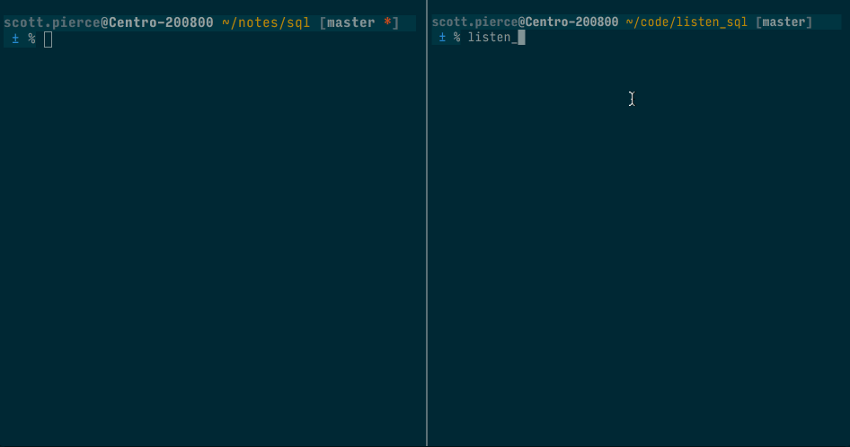

# Listen SQL

Helper scripts to monitor SQL file changes and execute them using psql.



## Usage

```sh
listen_sql DIR DBNAME
# DIR - directory contains SQL files
# DBNAME - Postgres DB name to passed to `psql` command. 
```

`listen_sql` uses `exec_sql` to perform syntax highlighting of original SQL
contents.

```sh
exec_sql SRC DBNAME [--no-color]
# SRC - source file contain SQL
# DBNAME - Postgres DB name to passed to `psql` command. 
# [Optional] --no-color - to disable ANSI color codes.
```

## Installation

Add this line to your application's Gemfile:

```ruby
gem 'listen_sql'
```

And then execute:

$ bundle

Or install it yourself as:

$ gem install listen_sql

### rbenv Users
You'll need to link your bin files so gem executables are accessible in your
shell. [rbenv rehash](https://github.com/rbenv/rbenv#rbenv-rehash)

```sh
rbenv rehash
```

## Development

After checking out the repo, run `bin/setup` to install dependencies. Then, run
`rake spec` to run the tests. You can also run `bin/console` for an interactive
prompt that will allow you to experiment.

To install this gem onto your local machine, run `bundle exec rake install`. To
release a new version, update the version number in `version.rb`, and then run
`bundle exec rake release`, which will create a git tag for the version, push
git commits and tags, and push the `.gem` file to
[rubygems.org](https://rubygems.org).

## Contributing

Bug reports and pull requests are welcome on GitHub at
https://github.com/ddrscott/listen_sql.


## License

The gem is available as open source under the terms of the
[MIT License](http://opensource.org/licenses/MIT).

